<h1>TrustedFirmware OpenCI Users Guide</h1>

**Table of Contents**

[TOC]

# User Guide
This Google Document is a draft for development and review. Once reviewed, the doc will be made available on Phabricator on the trustedfirmware.org website where additional content will be added and reviewed.

This guide briefly explains how to use and contribute to the Trusted Firmware project https://www.trustedfirmware.org/, in particular the Trusted Firmware A https://www.trustedfirmware.org/projects/tf-a/ and Trusted Firmware M https://www.trustedfirmware.org/projects/tf-m/.

## How to Contribute to this Document
As a community project, help in all areas is greatly appreciated. If while using this document, issues are found or content can be improved, please follow the steps in this section to add your improvements to this document:

Note the steps were validated using Ubuntu 20.4. Other versions/OS's may need to be adjusted for.

* This document's source repository is located [here](https://git.trustedfirmware.org/ci/tf-ci-users-guide.git)
* First, you must authorize your account by navigating [here](https://github.com/login/oauth/authorize?response_type=code&client_id=1bdcda52ecaa25e3e63b&redirect_uri=https%3A%2F%2Freview.trustedfirmware.org%2Foauth&scope=user%3Aemail&state=fAZRKIu-VpdcK81W7P3tj9A8JpUFD47D00Uz5HTBsnw=) and clicking "Authorize."  This action will redirect you to the TrustedFirmware Review Dashboard.  **Make sure you're signed in!**
* Now click the "Browse" tab and click "Repositories"
* Navigate to the `ci/tf-ci-users-guide` repository and click on it.  You will land on the [admin page for the TF CI Users Guide](https://review.trustedfirmware.org/admin/repos/ci/tf-ci-users-guide)
* On the admin page in your browser, go to the settings page and then navigate to the SSH Keys section.
* Add your credentials
   * Since we will be using ssh, **open a terminal** and use the `ssh-keygen` command in your ~/.ssh directory to create a new keypair. Note you can use an existing key if you already have one.
   * Still in the terminal, navigate to your ~/.ssh directory and copy the `id_rsa.pub` key.
   * Back in your browser under the admin --> SSH Keys,  in the `New SSH Key` field, paste the `id_rsa.pub` key into the entry, give it a name and save it.

**You are now ready to set up your local environment**

* From a terminal, ensure that you have git and git-review set up:
```
sudo apt-get update
sudo apt install git
sudo apt install git-review
```
(This may install any required dependencies automatically.)

* set up your environment using `git config` to get your user.name, user.email, etc.
* create your UsersGuide working directory and navigate to it.
* Back in the Gerrit dashboard for the Users Guide, [found here](https://review.trustedfirmware.org/admin/repos/ci/tf-ci-users-guide), click on the `SSH` tab.
* On this page, copy the git clone example entry found in the `Clone with commit-msg hook` field.  This will be used on your local machine to clone the document that you can edit.
* Create and navigate to the local working directory and paste the above git clone command to clone the repo into your working directory.
* Make your edits to the docs/index.md file using the Markdown syntax. Using a markdown editor such as Remarkable can be helpful here.  Save the file and you're ready to create a pull request to the master repo.
* From your terminal, use `git add docs/index.md` to prep the modified file for the Gerrit review / PR.
* From the terminal, use `git commit -s` that will take you to an editor for sign-off.  Add your comment, save, and exit.
* From the terminal, enter `git review` to submit the pull request for the review to Gerrit.


## How to Contribute Code
The Trusted Firmware core projects, TF-M and TF-A, are both open source projects and both share the same way to accept user contributions.  Code changes, commonly known as patches or patchsets, are git-tracked so once the corresponding project is cloned, all content (history of previous patches which now are commits) is available at the user's machine.

TF projects use Gerrit [https://review.trustedfirmware.org/](https://review.trustedfirmware.org/) as a centralized system to push, update, review and review patches. Contributors must push their patches to gerrit, so CI and reviewers can see the proposed change. One can see the open ones at https://review.trustedfirmware.org/q/status:open.


Once a patch is approved, one of the core maintainers merges it to the main branch (master) through Gerrit. The same cycle is repeated for every patch, where a patch series may be merged in one step.

Mailing lists  https://lists.trustedfirmware.org/mailman/listinfo/tf-a https://lists.trustedfirmware.org/mailman/listinfo/tf-m are used to communicate latest news and also it is the main channel for users to post questions or issues, so it is a good idea to subscribe to these. Note, the mailing lists are not intended for patch reviews, so patches should go into Gerrit and news/questions/issues through the mailing lists.

### Gerrit Setup

Once the project is cloned, there are some two extra steps to setup gerrit properly: 1. setting up the gerrit remote repository and 2. Git-review package installation

For example, under the TF-A project, use the following command  to add the remote

```
$ git remote add gerrit ssh://<gerrit user>@review.trustedfirmware.org:29418/TF-A/trusted-firmware-a
```

For TF-M, the same command applies except that remote’s url is a bit different

```
$ git remote add gerrit ssh://<gerrit user>@review.trustedfirmware.org:29418/TF-M/trusted-firmware-m
```

As a safety check, run the command git remote -v and make sure gerrit remote is present. The next step is to install the git-review package in your corresponding Linux distribution.  For example, on Ubuntu this would be

```
$ sudo apt install git-review
```

and finally define the gerrit remote to be used with the following command

```
$ git review -r
```

If no issues are found at this point, you should be ready to start contributing to the project!

### Commit and review

No matter what change you want to make in any repository, one needs to create one or more commits into a local branch before submission. All commits must have ‘Signed-off-by’ and ‘Change-id’ strings in the commit description otherwise submission fails. The ‘Signed-off-by’ is introduced explicitly by the user (git commit -s) and the ‘Change-id’ automatically created by the git-review plugin. Patches should be atomic, just targeting one task. A commit’s subject should answer the question ‘what changed’ and the commit’s description answers the question ‘why it changed’. Be clear and always use present verbs, i.e use Add instead of Adding.

Once your commits are ready, type

```
git review
```

This command takes care of all the internal commands needed to send the patch to Gerrit, as seen below:


Once a patch is submitted, you must include one or more reviewers. The question then raises: who should I add as a reviewer? One  simple approach would be to look at the git history of the files you are modifying, and look for authors who have committed recently.

```
git log <path to file>
```

Once reviewers are included, you would probably get some feedback pretty soon. TF projects are quite active but in case you do not get any activity in a couple of days, reply from Gerrit indicating that you would like some feedback. Take the time to understand and review every comment and response properly, do corrections and update the patch promptly if required. Keep polishing the patch until all feedback/observations are resolved. A good practice is to create a new branch for each patch update (suffix a version number on the branch name) so one can switch back and forth between patch versions. CI output and reviewers’ comments are reflected in gerrit and email (the one that appears in your patch metadata), so be sure to check any of these after submission.

More details about Gerrit can be found in the upstream documentation:
	https://gerrit-documentation.storage.googleapis.com/Documentation/3.3.1/index.html

## From the maintainer's POV

All CI is done with Jenkins at https://ci.trustedfirmware.org/. There are lots of jobs, so as a first impression, it may seem difficult to follow the CI flow. The [Pipeline Description section](#pipeline-description) describes each project’s CI in detail.


Each project have different CI jobs and scripts hosted in the following repos. For example, TF-A and TF-M are in the list below:

* TF-A CI Jobs [https://git.trustedfirmware.org/ci/tf-a-job-configs.git/](https://git.trustedfirmware.org/ci/tf-a-job-configs.git/)
* TF-A CI Scripts [https://git.trustedfirmware.org/ci/tf-a-ci-scripts.git/](https://git.trustedfirmware.org/ci/tf-a-ci-scripts.git/)
* TF-M CI Jobs [https://git.trustedfirmware.org/ci/tf-m-job-configs.git/](https://git.trustedfirmware.org/ci/tf-m-job-configs.git/)
* TF-M CI Scripts [https://git.trustedfirmware.org/ci/tf-m-ci-scripts.git/](https://git.trustedfirmware.org/ci/tf-m-ci-scripts.git/)

To see the full list of CI jobs and scripts repos for all projects in Open CI, navigate here: [https://git.trustedfirmware.org/ci/](https://git.trustedfirmware.org/ci/)

The job config repositories contain Jenkins Job Definitions, called JJB (Jenkins Job Builders) files. The  CI scripts repositories host scripts that are required for the CI, i.e build scripts, static checks, etc.

## Manual Job trigger

For patches that arrive at gerrit, the CI is explicitly triggered by a core maintainer. However there are cases where a particular job needs to be rebuilt. Jobs can be rebuilt at any level, from the trigger job to the job that builds or launches the LAVA execution. For example, the below picture shows a trigger job with the ‘Build with Parameters’ and ‘Rebuild last’ options. Both options allow the maintainer to change any job parameter before actually executing it.


Most  probably, you may want to go to a specific failed job and ‘Rebuild’


There may be many reasons to rebuild but perhaps the most trivial one is to make sure the error is valid and not a transient one. Look at the job’s console for errors.

# LAVA documentation

LAVA(Linaro Automation and Validation Architecture) provides detailed documentation that can be found [here](https://docs.lavasoftware.org/lava/index.html).

## Supported platforms

TF project support the following platforms in LAVA [https://tf.validation.linaro.org/scheduler/device_types](https://tf.validation.linaro.org/scheduler/device_types)


### TF-A supported platforms

Until recently, the only supported platform was the Juno board but now it also supports FVP models:

* https://tf.validation.linaro.org/scheduler/device_type/juno
* https://tf.validation.linaro.org/scheduler/device_type/fvp

FVP models are virtual platforms that are able to emulate specific Arm reference designs or platforms. See the Arm documentation for more details: https://developer.arm.com/tools-and-software/simulation-models/fixed-virtual-platforms

These models are present on several docker images and LAVA uses these to boot and test a particular model. The specific docker image and model type are defined in the (LAVA) job definition. Docker images (containing the models) are available in a private docker registry (987685672616.dkr.ecr.us-east-1.amazonaws.com) that LAVA has access to. At the time of this writing,  these are the docker image names

* fvp:fvp_base_revc-2xaemv8a_11.12_38
* fvp:foundation_platform_11.12_38
* fvp:fvp_arm_std_library_11.12_38

Tag name, i.e. fvp_base_revc-2xaemv8a_11.12_38, corresponds to the particular model download from https://developer.arm.com/tools-and-software/simulation-models/fixed-virtual-platforms.


### TF-M supported platforms

TF-M LAVA devices are:

* mps https://tf.validation.linaro.org/scheduler/device_type/mps
* musca_b https://tf.validation.linaro.org/scheduler/device_type/musca-b
* qemu https://tf.validation.linaro.org/scheduler/device_type/qemu.

## How to navigate tf.validation.linaro.org

All LAVA jobs triggered by Jenkins are executed at the TF LAVA lab https://tf.validation.linaro.org/ instance. The Jenkins jobs that launch LAVA jobs are: `tf-a-builder` https://ci.trustedfirmware.org/job/tf-a-builder/ and `tf-m-lava-submit` https://ci.trustedfirmware.org/job/tf-m-lava-submit/. The Jenkins jobs contain the corresponding LAVA id which can be used to find the corresponding job at https://tf.validation.linaro.org/. In case of `tf-a-builder` job, the LAVA log itself is fetched from LAVA lab and attached to the job as seen below:


At the https://tf.validation.linaro.org/scheduler/alljobs link, one can go to a particular job to check results directly from LAVA:


One useful feature is the possibility to resubmit jobs: this enables the user to quickly modify a job definition and test it without the need to retrigger the full build from Jenkins:


## How to read a job and investigate results

The entrypoint to investigate a job failure is looking at the job’s landing page, i.e. https://tf.validation.linaro.org/scheduler/job/74086


Depending on the device type and job definition, the output can vary considerably. One can filter out relevant logs by clicking the different log levels. As in any system, failures can occur at any time and for different reasons, i.e introduced by a user's patch or scripts/infrastructure. In any case, a core maintainer should monitor and report or fix it accordingly.

# Pipeline description

The TF Open CI is divided into two separate pipelines, each handling the respective project (TF-A vs TF-M). Each is different in design so we describe each separately.

## TF-A CI pipeline description

The TF-A CI pipeline https://git.trustedfirmware.org/ci/tf-a-job-configs.git/ underwent refactoring based on requirements in https://developer.trustedfirmware.org/w/collaboration/openci/, going from testing a single test configuration to hundreds of them. Besides improving considerably the QA, it added some complexity as we will see below.

At the time of this writing, there are two (mostly) identical CIs:

* Internal CI aka Legacy CI: [https://jenkins.oss.arm.com/](https://jenkins.oss.arm.com/), running inside Arm (not accessible outside)
* Open CI: [https://ci.trustedfirmware.org/](https://ci.trustedfirmware.org/)

These are two CI instances running in parallel but in different environments: the internal CI runs in a single node (master node) while the Open CI in multiple nodes (docker nodes). In the near future, only the Open CI will be running once all the internal CI features are fully migrated.

Below is a general picture of the Trusted firmware A CI flow. Top boxes are Jenkins jobs, except those with .sh extensions.


The first job, the trigger-job, can be any job defined below, each covering a set of platforms and build/run configurations through test groups (TEST_GROUPS),  ultimately split as test descriptions (TEST_DESC). A  test description is tested by `tf-a-builder` job and a LAVA job is launched once artifacts are ready to be consumed.

In terms of the trigger source, jobs can be classified by either Gerrit or scheduled:

* Gerrit:
    * **tf-a-gerrit-tforg-l1**: multijob, Allow-CI+1, TF-A
    * **tf-a-gerrit-tforg-l2**: multijob, Allow-CI+2, TF-A
    * **tf-a-tftf-gerrit-tforg-l1:** multijob, Allow-CI+1, TF-A-tests
    * **tf-a-tftf-gerrit-tforg-l2:** multijob, Allow-CI+2, TF-A-tests

* Scheduled:
    * **tf-a-daily:** - scheduled daily

All the above jobs rely on downstream jobs:

* **tf-a-main:** multijob, TF-A and TF-A-tests
* **tf-a-coverity:** freestyle, runs coverity scan
* **tf-a-static-checks:** runs Arm static code checks
* **tf-a-ci-gateway:** split a test group (TEST_GROUPS) into multiple ‘.test’ files, each representing a test description (TEST_DESC)
* **tf-a-builder:** freestyle, builds the package and launch a LAVA job

Any job can be triggered manually by authorized users. Gerrit jobs are those triggered by assigning labels to a review, either ‘Allow-CI+1’ or ‘Allow-CI+2’, and track a particular project, either TF-A https://git.trustedfirmware.org/TF-A/trusted-firmware-a.git/ or TF-A tests https://git.trustedfirmware.org/TF-A/tf-a-tests.git/. The following screenshot shows an example of the `tf-a-gerrit-tforg-l1` job at the Jenkins instance:


The `tf-a-gerrit-tforg-l1` indicates the tracking project (tforg), and the level (l1). Levels indicate testing depth (test descriptions coverage) and are used in different phases in the development phase as seen below:


The job `tf-a-daily` runs daily, uses the latest code (the HEAD commit) and triggers two jobs: `tf-a-main` and `tf-a-coverity`. The job `tf-a-main` is the one covering most platforms so it takes longer to complete (approximately 1.5 hours)


Notice that the `tf-a-main` job also triggers `tf-a-static-checks`, the job that launches project-related static checks (copyright presence, headers in alphabetical order, line endings, coding style and banned APIs) and execute Clang static analyzer (scan-build).
The job `tf-a-coverity` runs the Coverity static code check and reports metrics (defects) at [https://scan.coverity.com/projects/arm-software-arm-trusted-firmware?tab=overview](https://scan.coverity.com/projects/arm-software-arm-trusted-firmware?tab=overview).

The job `tf-a-builder` is the builder job and its execution is containerized inside  docker-amd64-tf-a-bionic defined at https://git.trustedfirmware.org/ci/dockerfiles.git/ repository. Anyone can fetch it with the following command and use it for local compilation

```
docker pull trustedfirmware/ci-amd64-ubuntu:bionic
```

The result of tf-a-builder is a set of artifacts: binaries, build log, environment files, etc.


In particular, if build produces a LAVA definition file, job.yaml, a LAVA job is launched through SQUAD https://qa-reports.linaro.org/tf/. Once the LAVA job finishes, jenkins fetches the log from LAVA and stores it in the corresponding jenkins job. It is worth mentioning that not all tf-a-builder jobs produce a LAVA job, i.e fvp model not supported, ‘nil’ run configuration provided in the test description, static check, etc. however most FVP and Juno produce one. One can see all executed LAVA jobs at https://tf.validation.linaro.org/scheduler/alljobs.

Finally, depending on the CI execution outcome, this is reflected in Gerrit as ‘TrustedFirmware Code Review’ comments:


Results from those LAVA executed jobs on behalf of the corresponding gerrit patch are also reflected in Gerrit:


In case of a job failure, it is more likely that you want to investigate the issue starting at the Gerrit job, then following the CI job chain starting from the trigger job (top-bottom approach): 1. analyze results from the Gerrit job, 2. use the report table produced by each tf-a-ci-gateway job, 3. the tf-a-builder job and finally 4. the tf-a-builder’s console log. Looking at the following screenshots should help clarifying this concept.

1. Gerrit job level:


2. tf-a-ci-gateway level:


3. tf-a-builder level:


4. tf-a-builder’s console log view:


## TF-M CI pipeline description

### Job classification
TF-M jobs can be found at [https://ci.trustedfirmware.org/view/TF-M](https://ci.trustedfirmware.org/view/TF-M) and classified by use cases.

#### Per-patch job

Per-patch job is triggered by option *Allow-CI* in the _Reply_ button of each Gerrit review item to verify TF-M patches before merge. The job votes to Gerrit with a Code Review +1 if it passed and Code Review -1 once failed.

<figure markdown>
  <div style="text-align: center">
    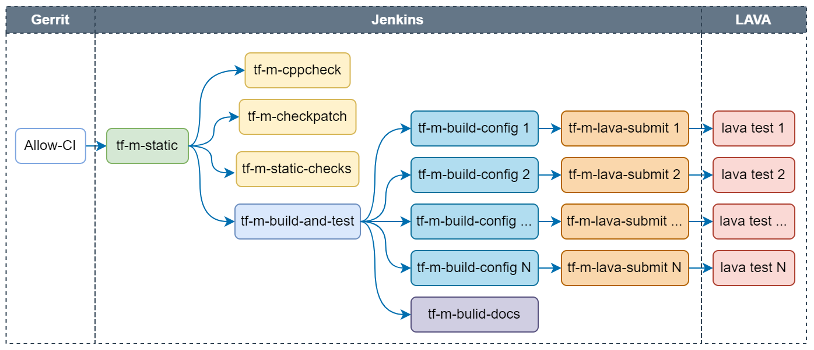
  </div>
</figure>

Following checks are covered in per-patch job:

* __Static check__: Include tf-m-cppcheck (using [CppCheck](https://cppcheck.sourceforge.io/)), tf-m-checkpatch (using [CheckPatch](https://github.com/torvalds/linux/blob/v5.9/scripts/checkpatch.pl)) and tf-m-static-checks (checking trailing spaces, etc.), which are three independent jobs.
* __Build configs__: Build TF-M images with tf-m-build-config jobs in parallel. Each job builds one config. Configs built by per-patch job are listed [here](https://ci.trustedfirmware.org/view/TF-M/job/tf-m-build-and-test/lastSuccessfulBuild/artifact/build_links.html).
* __Build docs__: Build TF-M [user guide](https://ci.trustedfirmware.org/job/tf-m-build-docs/lastSuccessfulBuild/artifact/trusted-firmware-m/build/docs/user_guide/html/index.html) and [reference manual](https://ci.trustedfirmware.org/job/tf-m-build-docs/lastSuccessfulBuild/artifact/trusted-firmware-m/build/docs/reference_manual/html/index.html) based on the current patch.
* __Test images__: Run TF-M images on target devices which are managed on [LAVA server](https://tf.validation.linaro.org/). Tf-m-build-config job will trigger tf-m-lava-submit job to start a LAVA test on the supported device, to verify the image built by tf-m-build-config job. Tests on following devices are covered in per-patch job: AN519 FVP, AN521 FVP, AN552 FVP, Corstone1000 FVP, STM32L562E_DK and Cypress/PSOC64.

Every check job generates a vote to Gerrit with corresponding job link. There wil be a final __Verified +1__ from _TrustedFirmware Code Review_ once all checks passed. Otherwise a __Verfied -1__ will be voted.

<figure markdown>
  <div style="text-align: center">
    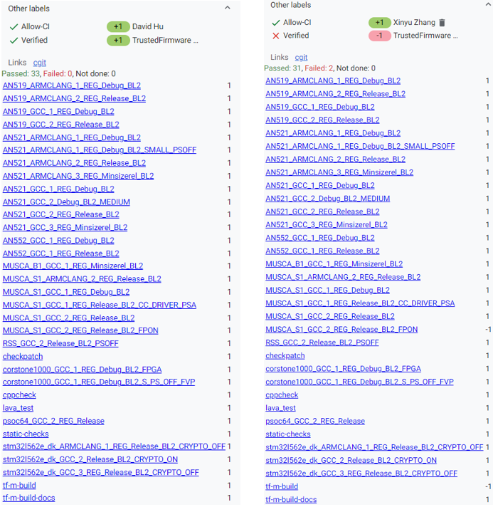
  </div>
</figure>

__Note:__ If any dependency version (MbedTLS, MCUBoot, etc.) is changed in TF-M patch, *Allow-CI* will automatically verify the TF-M patch together with the dependency in new version. If there is an unmerged patch in other TF-M repos, such as tf-m-tests or tf-m-extras, update the dependency version in TF-M configuration with the commit ID of that patch. And then trigger *Allow-CI* on the TF-M patch to update dependency version. The unmerged patch in dependency repo can also be verified together with the TF-M patch.

#### Nightly job

Nightly job is daily scheduled to check the health of latest HEAD on TF-M master branch. Email notification will be sent to [tf-m-ci-notifications](https://lists.trustedfirmware.org/mailman3/lists/tf-m-ci-notifications.lists.trustedfirmware.org/) mailing list once the job failed. [TF-M user guide](https://tf-m-user-guide.trustedfirmware.org/) posted to [trustedfirmware.org](https://www.trustedfirmware.org/) is also daily generated by tf-m-build-docs-nightly in nightly job.

<figure markdown>
  <div style="text-align: center">
    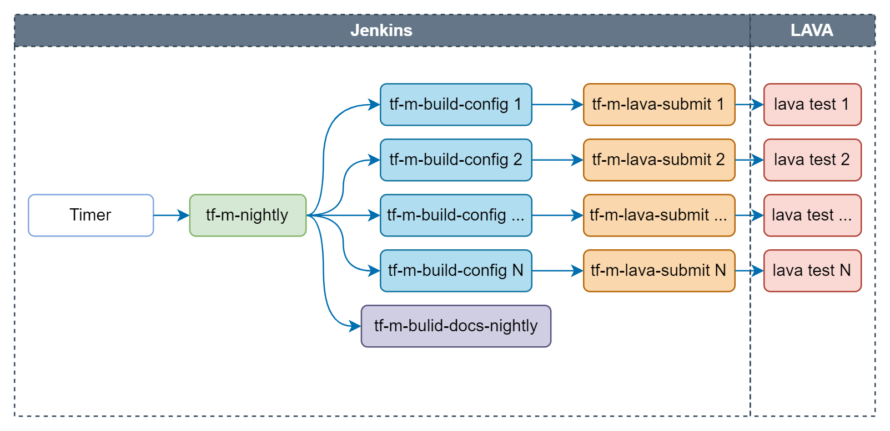
  </div>
</figure>

Following checks are covered in nightly job:

* __Build configs__: Configs built by nightly job are listed [here](https://ci.trustedfirmware.org/view/TF-M/job/tf-m-nightly/lastSuccessfulBuild/artifact/build_links.html).
* __Build docs__: Build TF-M [user guide](https://tf-m-user-guide.trustedfirmware.org/) and [reference manual](https://ci.trustedfirmware.org/job/tf-m-build-docs-nightly/lastSuccessfulBuild/artifact/trusted-firmware-m/build/docs/reference_manual/html/index.html) based on the latest TF-M master branch and posted to [trustedfirmware.org](https://www.trustedfirmware.org/).
* __Test images__: Tests on following devices are covered in nightly job: AN519 FVP, AN521 FVP, AN521 FPGA, AN521 QEMU, AN552 FVP, Corstone1000 FVP, STM32L562E_DK, NXP/lpcxpresso55s69 and Cypress/PSOC64.

#### Release job

Release job is scheduled bi-weekly to make sure the latest TF-M on master branch could pass all release tests. It will also be manually triggered for release branch during release stage.

<figure markdown>
  <div style="text-align: center">
    
  </div>
</figure>

Following checks are covered in release job:

* __Build configs__: Configs built by release job are listed [here](https://ci.trustedfirmware.org/view/TF-M/job/tf-m-release/lastSuccessfulBuild/artifact/build_links.html).
* __Build docs__: Build TF-M [user guide](https://ci.trustedfirmware.org/job/tf-m-build-docs/lastSuccessfulBuild/artifact/trusted-firmware-m/build/docs/user_guide/html/index.html) and [reference manual](https://ci.trustedfirmware.org/job/tf-m-build-docs/lastSuccessfulBuild/artifact/trusted-firmware-m/build/docs/reference_manual/html/index.html) based on the current HEAD of master/release branch.
* __Test images__: Tests on following devices are covered in release job: AN519 FVP, AN521 FVP, AN521 FPGA, AN521 QEMU, AN552 FVP, Corstone1000 FVP, STM32L562E_DK, NXP/lpcxpresso55s69 and Cypress/PSOC64.

#### Code coverage job

Code coverage job is scheduled weekly to monitor the code coverage of tests in the latest TF-M on master branch.

<figure markdown>
  <div style="text-align: center">
    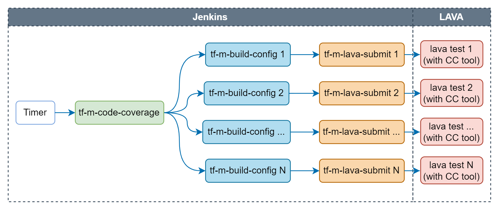
  </div>
</figure>

Following configs are covered in code coverage job:

* __Build configs__: Configs built by code coverage job are listed [here](https://ci.trustedfirmware.org/job/tf-m-code-coverage/lastSuccessfulBuild/artifact/build_links.html).
* __Test images__: Tests on AN521 FVP will be traced by [qa-tool](https://git.trustedfirmware.org/ci/qa-tools.git) to get the code coverage data.

The final code coverage data is available in the job artifacts at [merged_report/index.html](https://ci.trustedfirmware.org/job/tf-m-code-coverage/lastSuccessfulBuild/artifact/merged_report/index.html)

#### Extra build job

Extra build job is daily scheduled to check whether the latest TF-M could be correctly built for platforms supported by TF-M. Images are only built but not tested in this job. Configs built by extra build job are listed [here](https://ci.trustedfirmware.org/view/TF-M/job/tf-m-extra-build/lastSuccessfulBuild/artifact/build_links.html).

<figure markdown>
  <div style="text-align: center">
    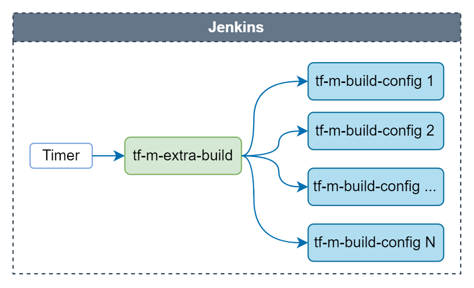
  </div>
</figure>

### Job logs

For detailed logs, please go to the job link and choose __Console Output__ at the left column of the page.

<figure markdown>
  <div style="text-align: center">
    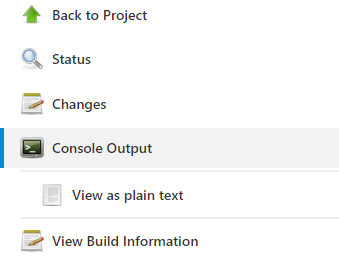
  </div>
</figure>

And then search for the key word needs to be checked.

For example, search for "fail" to see the error cause.

<figure markdown>
  <div style="text-align: center">
    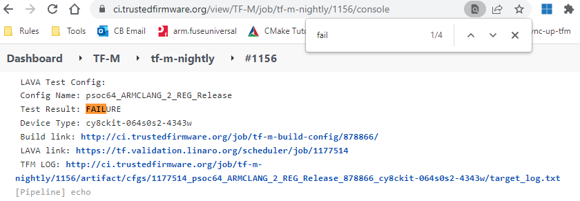
  </div>
</figure>

Or seach for config name that needs to be checked.

<figure markdown>
  <div style="text-align: center">
    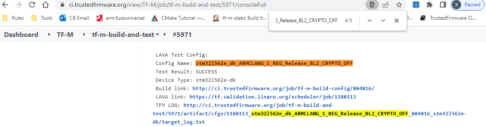
  </div>
</figure>

* __NOTE__: If LAVA test is run on FVP, LAVA link is only accessible to authorized users. Please check __TFM LOG__ to find the test result. If access to LAVA job is necessary, please contact [tf-openci@lists.trustedfirmware.org](tf-openci@lists.trustedfirmware.org) for help.

<figure markdown>
  <div style="text-align: center">
    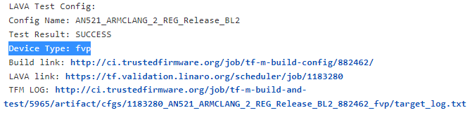
  </div>
</figure>

### Job artifacts

Artifacts archived by each job can be found in __Build Artifacts__.

* __Build binary__: TF-M build binary of each config is available in corresponding tf-m-build-config job.
* __Result summary__: Summary of all build and test results in both csv and html formats are available in artifacts of tf-m-build-and-test, tf-m-nightly and tf-m-release correspondingly for per-patch, nightly and release jobs.

<figure markdown>
  <div style="text-align: center">
    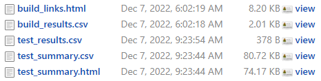
  </div>
</figure>

### Build environment

#### Toolchain

There are different versions of toolchain installed in CI workspace. Each tf-m-build-config job selects the needed version automatically. To check the chosen toolchain, search for the name of toolchain (arm-none-eabi-gcc, armclang) in the job console.

<figure markdown>
  <div style="text-align: center">
    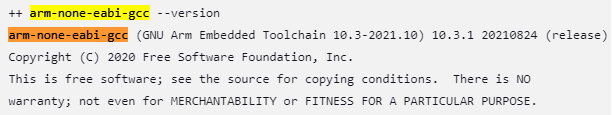
  </div>
</figure>

#### Dependencies

 * Dependency tools installed in TF-M CI workspace are listed [here](https://git.trustedfirmware.org/ci/dockerfiles.git/tree/bionic-amd64-tf-m-build/tf-dependencies.install).
 * Python packages installed in TF-M CI workspace are listed [here](https://git.trustedfirmware.org/ci/dockerfiles.git/tree/bionic-amd64-tf-m-build/requirements_python3.txt).

## Code coverage support

Both TF-A and TF-M jobs support performing code coverage analysis. Mechanisms for
requesting this analysis are different:

* TF-A: There are special test groups which enable code coverage,
  e.g. `tf-l3-code-coverage`.
* TF-M: Setting `CODE_COVERAGE_EN` parameter of a job to `TRUE`.

There is a following path to produce a code coverage report:

1. If code coverage is enabled, FVP job in LAVA is run with a special
coverage/instruction tracing plugin, which at the end of FVP execution
outputs address of each instruction which was executed. It should be noted
that as of now, code coverage support relies on this FVP plugin and is
available only for the FVP targets.
2. A [custom utility](https://git.trustedfirmware.org/ci/qa-tools.git/)
post-processes this trace file and converts it into the input format
for the `lcov` code-coverage tool.
3. `lcov` is used to generate a code coverage report in the HTML format, which
is published as an artifact together with other deliverables of a build.

Individual job builds oftentimes cover only a particular configuration (hardware
platform, testsuite, etc.). Thus, code coverage produced from a single build
is partial, exercising only a subset of the project code. To address this
limitation, there is also a support to overlap multiple individual code coverage
reports to produce a "collective" or "merged" report, better representing
coverage of the entire project. An "umbrella" CI job (`tf-a-ci-gateway` for
TF-A, `tf-m-build-and-test` for TF-M) automatically produces a merged report
if code coverage is enabled and there are 2 or more configurations are built
by its sub-jobs.

## Static analysis

A number of static analyses are performed by OpenCI jobs. Basic examples are
checking format of a commit message, code style conventions and usage of
deprecated APIs. More deep and involved analyses are described below.

### Coverity analysis

[Coverity](https://en.wikipedia.org/wiki/Coverity) is a proprietary
cloud-based static analisys tool which helps to find bugs and issues
in C (etc.) based projects. Both TF-A and TF-M are run thru Coverity
analysis, using jobs `tf-a-coverity` and `tf-m-coverity`.

TF-A Coverity stats can viewed at
[https://scan.coverity.com/projects/arm-software-arm-trusted-firmware](https://scan.coverity.com/projects/arm-software-arm-trusted-firmware)
(a login required, e.g. via a Github). Individual defects can be viewed by
requesting being added to the project.

Note that Coverity also includes a large share of analyses required for
MISRA compliance. Information about this aspect can be found at
[https://developer.trustedfirmware.org/w/tf_a/tf-a-misra-analysis/](https://developer.trustedfirmware.org/w/tf_a/tf-a-misra-analysis/).

### MISRA analysis using ECLAIR tool

[MISRA C](https://en.wikipedia.org/wiki/MISRA_C) is a well-known industry
standard for ensuring system quality and safety. The Trusted Firmware project
aspires to adhere to the MISRA guidelines as much as reasonably possible,
with the help of its stakeholders and contributors. Note that to warrant
a particular level of MISRA C compliance, a *specific product* must undergo
MISRA C certification. An example of a "specific product" in the context
of Trusted Firmware would be a particular version of Trusted Firmware configured
for a particular target system, built with a specific toolchain, etc. The
upstream Trusted Firmware project is not a specific product, but rather a
framework / umbrella codebase with high number of configuration choices.
The upstream project thus does not seek for MISRA C certification itself.
Instead, the aim is to provide largely MISRA C compliant codebase, allow
contributors to improve the level of compliance, and help downstream
users / vendors to proceed with the formal MISRA C certification if they
choose so.

Bugseng [ECLAIR](https://www.bugseng.com/eclair) is a proprietary advanced system
for in-depth MISRA analysis and reporting. One of its distinguishable
features is ability to work in "differential" mode - to report issues
which appeared (or were resolved) in one codebase comparing to another.
This allows to use it to analyze individual patches prior to them being
merged to the Trusted Firmware projects.

ECLAIR is a complex and advanced system with many features and configuration
parameters. The manual is included in the ECLAIR distribution, but is otherwise
not publicly available or redistributable. Some aspects of ECLAIR usage are
covered in the [FAQ which is available online](https://www.bugseng.com/filebrowser/download/234).
Other documents and whitepapers are available at
[https://www.bugseng.com/content/documentation](https://www.bugseng.com/content/documentation).

ECLAIR can generate reports in a number of formats. For Trusted Firmware,
we generate plain-text and HTML reports. HTML reports are interactive
and allow to "drill down" thru the codebase to explore individual issues.
There're also search, filtering, and basic diagramming capabilities.

At this time, a pilot implementation of ECLAIR testing is available for
TF-A. It should be noted that primary purpose of ECLAIR is end-to-end
preparation of a particular software product to the MISRA compliance
testing. A "software product" in means very specific and
statically defined codebase and its configuration (down to toolchain
used to build it). This is different from from the nature of the
Trusted Firmware projects: they are essentially frameworks, supporting
a large number of platforms, and even larger number of configuration
options, both pertinent to general configuration of TF, or to a particular
platform. Such a nature of TF poses a challenge of testing it with
a tool like ECLAIR: we are effectively dealing with superimposition
of hundreds of products, and testing those is problematic both
from the performance (too much time to test all configs) and reporting
(too much repetetive content) points of view. This necesitates
testing only a subset of platforms and options. Increasing number
of tested configurations, while producing easy to understand and
act on reports is a subject of future work.

There are following ECLAIR jobs for TF-A:

* [tf-a-eclair-daily](https://ci.trustedfirmware.org/job/tf-a-eclair-daily/) -
  whole codebase testing, with multiple configurations, running daily. This
  job is useful for tracking "absolute" figures of MISRA issues in the codebase,
  as well as following trends.
* [tf-a-eclair-delta](https://ci.trustedfirmware.org/job/tf-a-eclair-delta/) -
  this job tests patches submitted to Gerrit, and is intended to help with
  reviews, the aim being that a patch doesn't introduce *new*
  MISRA issues, even if the codebase in general has some number of issues,
  which can't be addressed short-term (or at all). The job is triggered by
  assigning `Allow-CI+1`/`Allow-CI+2` label to a review, similar to other
  CI jobs testing individual patches. To provide quick turnaround and
  reasonable system load, this job is currently builds just a single TF-A
  configuration. This may change in the future when more configurations
  are added to the workflow.

Both jobs are structured as matrix jobs, with the single axis being a TF-A
platform. ECLAIR reports are publish as job artifacts. For each job, they are:

* `tf-a-eclair-daily`:
    * `ECLAIR/full_txt` - "Full TXT" report ("full" means that both codebase-level
      summaries and individual file reports are provided)
    * `ECLAIR/full_html` - "Full HTML" report (likewise, both codebase summaries
      are provide, and it's possible to "drill down" to individual files, seeing
      the full source code, with MISRA annotations). The report is interactive and
      with simple diagramming capabilities, allowing to group issues by different
      criteria.
    * `index.html` - Index file, providing quick access to the text report and
      different presets of the HTML report. Of the particular interest is
      "Report by issue strictness", which shows breakdown of the
      Mandatory/Required/Advisory issues, according to the MISRA classification.

* `tf-a-eclair-delta`:
    * `diff_output/` - The primary differential text report generated by ECLAIR.
      The issues are groupped by a MISRA rule, all issues pertinent to a particular
      rule (across the codebase), residing in one file, named like `MC3R1.R20.9.add.etr`,
      where `MC3R1.R20.9` is rule identifier, `add` meaning this file lists issues
      added by the patch, while `del` - issues resolved by the patch.
    * `misra_delta.txt` - Reports from `diff_output/`, concatenated into a single
      file. Contents of this file also gets posted as a comment to Gerrit patch.
    * `new_issues_html/` - HTML report for newly added issues.
    * `resolved_issues_html/` - HTML report for resolved issues (what you see
      here is the state of the source code *before* the patch).
    * `index.html` - Index file, providing quick access to the reports above.

#### Browsing and understanding ECLAIR reports

ECLAIR reports are information and functionality packed, and besides familiarity
with the MISRA standard itself and the ECLAIR manual, require some practice to
understand and use.

One good way to learn how to use and understand reports is to watch instruction
videos provided on the [Bugseng Youtube channel](https://www.youtube.com/@BUGSENG/videos).

Some useful videos are listed below. Before reviewing them, it is useful to know
some basic terminology related to ECLAIR:

* a report - A report is an entry in a report document produced by ECLAIR. It can
  be seen as a synonym of "issue", but a different term is used to emphasize
  that not every entry produced by ECLAIR is formally an "issue" or "violation"
  of a specific MISRA rule. See e.g. "information" report kind below.

* report kind (violation, caution, information): A "violation" is a type of
  issue which was formally verified by ECLAIR to violate a corresponding MISRA
  directive/rule. "Caution" kind is assigned to issues which could not be
  100% formally verified by ECLAIR, at yet it suspects there may be an
  issue. Put it another way, there can be a possibility of false positive
  in case of "caution". Finally, "information" is not an issue with the code
  per se, but some additional information along the lines of "know the
  codebase better". These are output by ECLAIR because the underlying spirit
  of the MISRA specification is that to produce a safe/verified code, as much
  as possible information about it should be known and understood. Different
  kinds of issues are useful for different purposes (and less useful for other).
  For example, for crude quantitative totals, it would be counter-intuitive
  and misleading to include number of "information" reports.

* issue severity (mandatory, required, advisory) - this is actually MISRA
  classification, each MISRA directive/rule (and thus issues related to them)
  is classified as one of 3 severeties above.

List of introductory videos for using reports:

* [https://youtu.be/e3W6j38KpHU?t=725](https://youtu.be/e3W6j38KpHU?t=725)

Example of browsing an (HTML) report, filtering it by different criteria,
and understanding what this means. The video is recorded against an older
ECLAIR release, so there are small differences in the report look. The video
starts showing how to use ECLAIR GUI to produce a report, but the link above
starts with a timecode where a report is discussed. The video discusses in
particular what ECLAIR's "violation" vs "caution" vs "information" means.

* [https://youtu.be/K0hiYQFdOsk?t=310](https://youtu.be/K0hiYQFdOsk?t=310)

Browsing a report, understanding individual items in it, and addressing
them in a project.

* [https://youtu.be/JiMyldzHNis&t=1830s](https://youtu.be/JiMyldzHNis&t=1830s)

Introduction and usage of "sunburst chart" in the ECLAIR reports.

There is also available a ["cheat sheet"](images/eclair/eclair_diagram_cheatsheet.svg)
for using the main report page with a sunburst chart.

## The TF Jenkins Job Builder (JJB) configs

The TF project uses YAML files to define Jenkins jobs using Jenkins Job Builder (JJB): https://docs.openstack.org/infra/jenkins-job-builder/definition.html. Jobs currently defined for both projects are at https://git.trustedfirmware.org/ci/tf-m-job-configs.git/ and https://git.trustedfirmware.org/ci/tf-a-job-configs.git/. Job triggers are special types of jobs that listen to certain gerrit events. For example the job https://git.trustedfirmware.org/ci/tf-a-job-configs.git/tree/tf-a-gerrit-tforg-l1.yaml triggers every time a TF-A maintainer ‘Allows +1’ the CI to execute as defined the job’s trigger section:

```
...
	triggers:	
	- gerrit:	
	server-name: review.trustedfirmware.org
    	trigger-on:
      		- comment-added-event:
          	approval-category: "Allow-CI"
          	approval-value: 1
    	projects:	
    	- project-compare-type: PLAIN
      		project-pattern: TF-A/trusted-firmware-a
      		branches:
        		- branch-compare-type: PLAIN
          		branch-pattern: integration
...
```

## JJBs and Jenkins Jobs

JJB defines the behaviour of a Job through a YAML file, where Jenkins use these to create jobs (it is similar to Class and Object concepts in Object Oriented Programming). For example this is JJB of TF-A Level1 trigger: https://git.trustedfirmware.org/ci/tf-a-job-configs.git/tree/tf-gerrit-tforg-l1.yaml which is instanciated at  https://ci.trustedfirmware.org/job/tf-gerrit-tforg-l1/. Similar pattern applies for the rest of the JJB files.

## Calling CI scripts from JJB jobs

JJB files themselves do not do much unless they execute something useful. CI scripts are kept in separate repositories depending on the project. Below is the relationship between jobs and scripts repositories per project

* TF-A CI Jobs https://git.trustedfirmware.org/ci/tf-a-job-configs.git/
* TF-A CI Scripts https://git.trustedfirmware.org/ci/tf-a-ci-scripts.git/
* TF-M CI Jobs https://git.trustedfirmware.org/ci/tf-m-job-configs.git/
* TF-M CI Scripts https://git.trustedfirmware.org/ci/tf-m-ci-scripts.git/

In general, Jenkins jobs call scripts, the latter do the corresponding task. For example, below is shown again CI flow for the TF-A project


Where builders.sh is just a setup script (located at TF-A jobs repo) that finally calls run_local_ci.sh script located CI scripts repo, which is the entrypoint of the script execution. The run_local_ci.sh in turn calls others scripts that finally build the package.

# CI Scripts overview

## TF-A CI scripts overview

The TF-A CI repository https://git.trustedfirmware.org/ci/tf-a-ci-scripts.git/ contains several folders and scripts for different purposes but we will not describe each one. Instead we will overview build package operation. Building a package means building (compiling) a specific platform with certain build parameters and post-build setup tasks, both indicated in a single test configuration (string or filename). The  operation is depicted in the following diagram:


The test configuration concisely specifies a single test: what set of images to build, how to build them, and finally, how to run a test using the aforementioned images. A test configuration is a specially-named plain text file whose name comprises two parts: the build configuration and the run configuration.

The test configuration file is named in the following format:

```
{tf-build-config | nil}[,tftf-build-config]: { run-config | nil}
```

That is, it contains:

* Mandatory build configuration for TF, or nil if TF is not required to be built.
* Optional build configuration for TFTF;
* Mandatory run configuration, or nil for build-only configs.

The TF and TFTF build configs are separated by a comma; the build and run configs are separated by a colon. The test configuration is consumed by the build script , and produces a build package. For example, the test configuration
fvp-default,fvp-default:fvp-tftf-fip.tftf-aemv8a-debug chooses:

* To build TF with the fvp-default config;
* To build TFTF with the fvp-default config;
* To apply run config fvp-tftf-fip.tftf-aemv8a-debug

Build configurations are plain text files containing build parameters for a component; either TF or TFTF. The build parameters are sorted and listed one per line, and would appear on the component's build command line verbatim. Up to two build configurations can be specified – one for TF (mandatory), and another one for TFTF (optional). If the test doesn't require Trusted Firmware to be built (for example, for a TFTF build-only configuration), it must be specified as nil.

For example, the TF build config fvp-aarch32-tbb-mbedtls-rsa-ecdsa-with-ecdsa-rotpk-rsa-cert has the following contents as of this writing:

```
	AARCH32_SP=sp_min
	ARCH=aarch32
	ARM_ROTPK_LOCATION=devel_ecdsa
	CROSS_COMPILE=arm-none-eabi-
	GENERATE_COT=1
	KEY_ALG=rsa
	PLAT=fvp
	ROT_KEY=plat/arm/board/common/rotpk/arm_rotprivk_ecdsa.pem
	TF_MBEDTLS_KEY_ALG=rsa+ecdsa
	TRUSTED_BOARD_BOOT=1
```

Build configs are located under tf_config and tftf_config subdirectories in the CI repository.

As described above, the build configuration describes what components to build, and how to build them. Before a set of images can be exercised through the test, the CI usually needs to execute a sequence of steps that are necessary to set up the test environment. These steps largely depend on the specific nature of the test at hand, the platform to be run on, etc. These steps are related to but decoupled from the build configs and are defined in run configurations. Almost all tests run in the CI mandatorily require a certain combination of steps above, some others optional. Because of the variability in applying the steps, and to avoid duplication, common steps are made available as standalone script snippets, called fragments. Individual fragments can be strung together to form a Run Configuration. Run config fragments are located under run_config subdirectory in the CI repository.

For example, the following test configuration

```
tftf-l2-extensive-tests-fvp/fvp-tspd,fvp-extensive:fvp-tftf-fip.tftf-cortexa57x4a53x4-tspd
```

Produces the following build configs

```
Trusted Firmware config:

    CROSS_COMPILE=aarch64-none-elf-
    PLAT=fvp
    SPD=tspd

Trusted Firmware TF config:

    CROSS_COMPILE=aarch64-none-elf-
    PLAT=fvp
    TESTS=extensive
```

And the following run config fragments

```
	fvp-tftf
	fvp-fip.tftf
	fvp-cortexa57x4a53x4
	fvp-tspd
```

Producing the following (release) build package

```
.
├── artefacts
│   ├── build.log
│   ├── debug
│   │   ├── bl1.bin
│   │   ├── bl1.elf
│   │   ├── bl2.bin
│   │   ├── bl2.elf
│   │   ├── bl2u.bin
│   │   ├── bl2u.elf
│   │   ├── bl31.bin
│   │   ├── bl31.elf
│   │   ├── bl32.bin
│   │   ├── bl32.elf
│   │   ├── cactus.bin
│   │   ├── cactus.dtb
│   │   ├── cactus.elf
│   │   ├── cactus_mm.bin
│   │   ├── cactus_mm.elf
│   │   ├── el3_payload.bin
│   │   ├── fip.bin
│   │   ├── fvp-base-gicv3-psci.dtb
│   │   ├── fvp_fw_config.dtb
│   │   ├── fvp_nt_fw_config.dtb
│   │   ├── fvp_soc_fw_config.dtb
│   │   ├── fvp_tb_fw_config.dtb
│   │   ├── fvp_template.yaml
│   │   ├── fvp_tsp_fw_config.dtb
│   │   ├── fvp.yaml
│   │   ├── ivy.bin
│   │   ├── ivy.dtb
│   │   ├── ivy.elf
│   │   ├── job.yaml
│   │   ├── model_params
│   │   ├── ns_bl1u.bin
│   │   ├── ns_bl1u.elf
│   │   ├── ns_bl2u.bin
│   │   ├── ns_bl2u.elf
│   │   ├── quark.bin
│   │   ├── quark.dtb
│   │   ├── quark.elf
│   │   ├── run
│   │   ├── tftf.bin
│   │   └── tftf.elf
│   ├── env
│   └── release
.
.
├── fvp_template.yaml
├── fvp.yaml
├── job.yaml
├── lava_model_params
├── tmp.FlNca0PGGF
├── tmp.KMJFcZ0Zr6
├── tmp.ku5nXd85b4
├── tmp.mCaqKgvgfT
└── tmp.Sv3zjKIWz7
```

Ultimately, the job.yaml file above is the LAVA job definition, which contains the information required by LAVA (artefacts’ URL, model params, container containing the model, etc.) for a correct  job execution.

## TF-M CI scripts overview

TF-M Open CI has two repos:

* [tf-m-job-configs](https://git.trustedfirmware.org/ci/tf-m-job-configs.git): Job configs in [Jenkins Job Builder](#the-tf-jenkins-job-builder-jjb-configs) format.
* [tf-m-ci-scripts](https://git.trustedfirmware.org/ci/tf-m-ci-scripts.git): Scripts that run in Jenkins to build and test TF-M.

CI scripts use 2 tools to generate commands:

 * Build helper: Generate commands for building TF-M images.
 * LAVA helper: Generate config files for [LAVA instance](#tf-lava-instance) to run TF-M images and monitor the test results.

### Build helper

Build helper is a tool to generate build commands for different TF-M configs.

#### Config group

Build helper categorizes all the TF-M configs that are built in CI into different [groups](https://git.trustedfirmware.org/ci/tf-m-ci-scripts.git/tree/build_helper/build_helper_configs.py?h=TF-Mv1.8.0#n938), depending on CI jobs. The config groups for each CI job are set as the default value of [Filter Group](https://git.trustedfirmware.org/ci/tf-m-job-configs.git/tree/tf-m-nightly.yaml?h=TF-Mv1.8.0#n24), which is configured by [tf-m-job-configs](https://git.trustedfirmware.org/ci/tf-m-job-configs.git).

<figure markdown>
  <div style="text-align: center">
    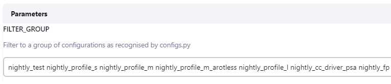
  </div>
</figure>

#### Generate commands to build TF-M image

Building TF-M image in a specific config consists of 4 steps in a tf-m-build-config job. Each step runs dedicated command. These commands are listed below in the order of build sequence.
- set_compiler
- cmake_config
- cmake_build
- post_build

##### Set compiler commands

There are several compilers in different versions installed in [CI docker image](https://git.trustedfirmware.org/ci/dockerfiles.git/tree/bionic-amd64-tf-m-build/Dockerfile?h=refs/heads/master#n13). To select correct compiler in correct version, each single tf-m-build-config job needs to run the commands to set compiler for current configuration.

Compiler and its version are selected in the *seed_params* introduced in [CMake config commands](#cmake-config-commands) section. [Set compiler command](https://git.trustedfirmware.org/ci/tf-m-ci-scripts.git/tree/build_helper/build_helper_configs.py?h=refs/heads/master#n66) is to add specified compiler path into system PATH.

```
export PATH=$PATH:$%(compiler)s_PATH
```

##### CMake config commands

In each config group, values of following 9 TF-M build config parameters in *seed_params* are combined to generate all configs covered in this group.

| Parameter        | TF-M CMake Build Config   | Value                                            |
| ---------------- | ------------------------- | ------------------------------------------------ |
| tfm_platform     | TFM_PLATFORM              | arm/mps2/an521, etc.                             |
| compiler         | TFM_TOOLCHAIN_FILE        | ARMCLANG_6_13 (ARMClang v6.13), etc.             |
| isolation_level  | TFM_ISOLATION_LEVEL       | 1 / 2 / 3                                        |
| test_regression  | TEST_BL2, TEST_S, TEST_NS | OFF / RegBL2 / RegS / RegNS                      |
| test_psa_api     | TEST_PSA_API              | OFF / IPC / CRYPTO/INITIAL_ATTESTATION / STORAGE |
| cmake_build_type | CMAKE_BUILD_TYPE          | Debug / Release / Minsizerel                     |
| with_bl2         | BL2                       | True / False                                     |
| profile          | TFM_PROFILE               | profile_small / profile_medium / profile_medium_arotless / profile_large,<br>empty string for base profile by default |
| extra_params     | Other customized configs  | Build config abbreviation in [mapExtraParams](https://git.trustedfirmware.org/ci/tf-m-ci-scripts.git/tree/build_helper/build_helper_config_maps.py?h=TF-Mv1.8.0#n56) |

For example, in config group [config_profile_m_arotless](https://git.trustedfirmware.org/ci/tf-m-ci-scripts.git/tree/build_helper/build_helper_configs.py#n366), 24 configs are generated by combining values in each seed params.

```
config_profile_m_arotless = {"seed_params": {
                             "tfm_platform":     ["arm/musca_b1"],
                             "compiler":         ["GCC_10_3", "ARMCLANG_6_13"],
                             "isolation_level":  ["1"],
                             "test_regression":  ["OFF", "RegBL2, RegS, RegNS"],
                             "test_psa_api":     ["OFF"],
                             "cmake_build_type": ["Debug", "Release", "Minsizerel"],
                             "with_bl2":         [True],
                             "profile":          ["profile_medium_arotless"],
                             "extra_params":     ["", "PSOFF"]
                             },
                             "common_params": _common_tfm_builder_cfg,
                             "invalid": _common_tfm_invalid_configs + []
                             }
```

The combination of these 9 *seed_params* is filled into the [build config template](https://git.trustedfirmware.org/ci/tf-m-ci-scripts.git/tree/build_helper/build_helper_configs.py?h=TF-Mv1.8.0#n48) by Build Helper and finally generates the complete CMake config command for this config.

To add some specific CMake config parameters into the command, a map of *"abbreviation: config command"* is added to [mapExtraParams](https://git.trustedfirmware.org/ci/tf-m-ci-scripts.git/tree/build_helper/build_helper_config_maps.py?h=TF-Mv1.8.0#n56) in build_helper_config_maps.py, and the abbreviation is added to *extra_params*.  For example, *"PSOFF"* in config group *config_profile_m_arotless* is the abbreviation of build config *"-DTFM_PARTITION_PROTECTED_STORAGE=OFF "*.

##### CMake build command

After CMake config is done, command for CMake build and install needs to be run. Typically the command is:
```
cmake --build <build_dir> -- install
```

##### Post build commands

If any extra command is needed by some platforms after building TF-M by CMake, the command is added to [post_build](https://git.trustedfirmware.org/ci/tf-m-ci-scripts.git/tree/build_helper/build_helper_configs.py?h=refs/heads/master#n78). For example, Musca B1 needs to run *srec_cat* command to generate the final image, the command is added [here](https://git.trustedfirmware.org/ci/tf-m-ci-scripts.git/tree/build_helper/build_helper_configs.py?h=refs/heads/master#n78).

#### Filter out invalid configs

To filter out specific configs from the config group, a config tuple with all the 9 seed params in sequence is added to the *invalid* list. Character "\*" stands for all values of the corresponding config parameter. For example, in config group *config_profile_s*, all configs for AN519 built with GCC v10.3 in Minsizerel type is not contained in this group.

```
config_profile_s = {"seed_params": {
                    "tfm_platform":     ["arm/mps2/an519", "arm/mps2/an521"],
                    "compiler":         ["GCC_10_3", "ARMCLANG_6_13"],
                    "isolation_level":  ["1"],
                    "test_regression":  ["OFF", "RegBL2, RegS, RegNS"],
                    "test_psa_api":     ["OFF"],
                    "cmake_build_type": ["Debug", "Release", "Minsizerel"],
                    "with_bl2":         [True],
                    "profile":          ["profile_small"],
                    "extra_params":     ["PSOFF"]
                    },
                    "common_params": _common_tfm_builder_cfg,
                    "invalid": _common_tfm_invalid_configs + [
                        ("arm/mps2/an519", "GCC_10_3", "*", "*",
                         "*", "Minsizerel", "*", "*", "*")
                    ]
                    }
```

#### Config name format

To keep the config name short and clear, config tuple is converted to string in a brief format, by using abbreviations to map the long config parameters into a shorter format in [build_helper_config_maps.py](https://git.trustedfirmware.org/ci/tf-m-ci-scripts.git/tree/build_helper/build_helper_config_maps.py?h=TF-Mv1.8.0). The detailed conversion logic is [here](https://git.trustedfirmware.org/ci/tf-m-ci-scripts.git/tree/tfm_ci_pylib/tfm_build_manager.py?h=TF-Mv1.8.0#n573).

#### How to add new configs

To support new TF-M features, it is recommanded to add a new config group for the new feature. Following steps are needed:

1. Add new config group in CI scripts. Please take this patch for reference: https://review.trustedfirmware.org/c/ci/tf-m-ci-scripts/+/17665

2. Run the following commands locally to verify whether the new config group works as expected.

   To list all configs covered in the new config group, run command:

   ```
   python3 <path of tf-m-ci-scripts>/configs.py -g <group_name>
   ```

   To get specific type of commands (set_compiler, cmake_config, cmake_build, post_build) for a config generated by Build Helper, run command:

   ```
   python3 <path of tf-m-ci-scripts>/configs.py <config_name> -b <command_type>
   ```

   To get the detailed values of each build parameters of a config, run command:

   ```
   python3 <path of tf-m-ci-scripts>/configs.py <config_name> --config_params
   ```

3. Enable the new config group by adding it as the default group in job configs. Please take this patch for reference: https://review.trustedfirmware.org/c/ci/tf-m-job-configs/+/17841

4. Verify the changes on Staging CI. For details please refer to [Staging Trusted Firmware System](#staging-trusted-firmware-system) section. If any permission is needed, please contact [tf-openci@lists.trustedfirmware.org](tf-openci@lists.trustedfirmware.org) for help.

### LAVA helper

LAVA helper is a tool to generate config files for [LAVA instance](#tf-lava-instance). The config files are submitted to LAVA server by Jenkins to run TF-M images on LAVA boards and monitor the test results.

All Open CI supported boards (including FVPs) are listed in [lava_gen_config_map](https://git.trustedfirmware.org/ci/tf-m-ci-scripts.git/tree/lava_helper/lava_helper_configs.py?h=TF-Mv1.8.0#n279), mapped with their configurations. The values of each config are filled by LAVA helper into the corresponding jinja2 template of the platform in [lava_helper/jinja2_templates](https://git.trustedfirmware.org/ci/tf-m-ci-scripts.git/tree/lava_helper/jinja2_templates?h=TF-Mv1.8.0).

For exmple, in [MPS2 FVP template file](https://git.trustedfirmware.org/ci/tf-m-ci-scripts.git/tree/lava_helper/jinja2_templates/fvp_mps2.jinja2?h=TF-Mv1.8.0), the path of FVP image and FVP command are set in this file. LAVA helper fills all the config values in [fvp_mps2_an521_bl2](https://git.trustedfirmware.org/ci/tf-m-ci-scripts.git/tree/lava_helper/lava_helper_configs.py?h=TF-Mv1.8.0#n133) into this template file, and then submit this config file to LAVA server to start the test on MPS2 FVP.

To decide whether the test run as expected, LAVA server uses __*monitors*__ to monitor the target log strings. Once the specified string is matched by LAVA monitor before timeout, it means that the test works as expected. Otherwise the tests fail.

There are 5 kinds of LAVA monitor configs defined in TF-M Open CI:

 * [no_reg_tests_monitors_cfg](https://git.trustedfirmware.org/ci/tf-m-ci-scripts.git/tree/lava_helper/lava_helper_configs.py#n33): Applied when regression tests are disabled.
 * [mcuboot_tests_monitor_cfg](https://git.trustedfirmware.org/ci/tf-m-ci-scripts.git/tree/lava_helper/lava_helper_configs.py#n44): Applied when BL2 tests are enabled.
 * [s_reg_tests_monitors_cfg](https://git.trustedfirmware.org/ci/tf-m-ci-scripts.git/tree/lava_helper/lava_helper_configs.py#n52): Applied when secure regression tests are enabled.
 * [ns_reg_tests_monitors_cfg](https://git.trustedfirmware.org/ci/tf-m-ci-scripts.git/tree/lava_helper/lava_helper_configs.py#n60): Applied when non-secure regression tests are enabled.
 * [arch_tests_monitors_cfg](https://git.trustedfirmware.org/ci/tf-m-ci-scripts.git/tree/lava_helper/lava_helper_configs.py#n68): Applied when PSA Arch tests are enabled.

These configs are categorized into 3 groups to deal with different kinds of LAVA tests:

 * [no_reg_tests_monitors](https://git.trustedfirmware.org/ci/tf-m-ci-scripts.git/tree/lava_helper/lava_helper_configs.py#n79): Consisted of monitor configs for no regression tests.
 * [reg_tests_monitors](https://git.trustedfirmware.org/ci/tf-m-ci-scripts.git/tree/lava_helper/lava_helper_configs.py#n81): According to build parameter "TEST_REGRESSION", monitor configs for regression tests of BL2, Secure and Non-Secure are correspondingly appended to this group.
 * [arch_tests_monitors](https://git.trustedfirmware.org/ci/tf-m-ci-scripts.git/tree/lava_helper/lava_helper_configs.py#n86): Consisted of monitor configs for PSA Arch tests.

#### How to add new platform

Platforms of [trustedfirmware.org](https://www.trustedfirmware.org/) members can be added to Open CI.

To add physical boards, please contact [tf-openci@lists.trustedfirmware.org](tf-openci@lists.trustedfirmware.org) for help.

To add FVP, please follow the instructions in [FVP Doker Images](#fvp-docker-images) to upload the new FVP image. If any permission or resources are needed, please contact [tf-openci@lists.trustedfirmware.org](tf-openci@lists.trustedfirmware.org) for help.

# TF LAVA Instance

The [LAVA instance](https://tf.validation.linaro.org) for the Trusted Firmware project is set up in Linaro Harston LAB. It consists of lava-master running on a hosted bare metal server, lava-dispatcher running on the same server. Additional dispatchers are deployed using Raspberry Pi 4 hardware. Note that this is required by certain classes of hardware not being differentiable before the OS boots, therefore a single device per dispatcher allows addressing these devices via an unique dispatcher (per device).

TF LAVA instance settings are stored in salt and ansible repositories:

* Salt repository: [https://git.linaro.org/lava/lava-lab.git](https://git.linaro.org/lava/lava-lab.git)
* Ansible repositories:
    * [https://git.linaro.org/lab-cambridge/ansible-lab.git](https://git.linaro.org/lab-cambridge/ansible-lab.git)
    * [https://git.linaro.org/lab-cambridge/lab-dns.git](https://git.linaro.org/lab-cambridge/lab-dns.git)
    * [https://git.linaro.org/lab-cambridge/lab-dhcp.git](https://git.linaro.org/lab-cambridge/lab-dhcp.git)

## TF LAVA instance replication

TF instance partially relies on Linaro infrastructure. Linaro’s login service (based on LDAP) is used for users authentication and logging into the TF LAVA instance. Therefore it’s not possible to replicate identical LAVA instance accounts outside of Linaro’s infrastructure. Apart from that, all configurations are stored in Salt or Ansible repositories. Replicating the remaining part of the instance can be done using Salt and Ansible tools with a new set of inventory variables.

Before an instance is ready various Ansible playbooks need to be run and, for LAVA setups, Salt needs to be run.

For Ansible, you need to go on deb-ansible host (`ssh root@192.168.128.15`). As root:

```
	# (cd /srv/lava-lab; git pull)
	# cd /etc/ansible/playbooks
	# ansible-playbook -i ../inventory/tf lava-lab.yml
```

The following playbooks are used to configure all the relevant parts:

* `lab_sssd_auth.yml`: enable LDAP authentication
* `lab_snmp_enable.yml`: enable SNMP, and non-free/contrib apt sources (needed for working SNMP set up with APC PDUs)
* `lab_docker.yml`: install docker apt repository and docker service itself
* `lab_aws_client.yml`: enable AWS authentication with AWS to preload docker images
* `lab_lava_repo.yml`: add LAVA apt repository
* `dhcp_tf.yml`: for the static leases and general DHCP server configuration

Installing LAVA (worker and master) is a manual process. After that, the `lava-lab.yml` file takes care of setting up the correct device dictionaries, device types and health checks as configured in the separate [lava-lab repository](https://git.linaro.org/lava/lava-lab.git).

Until the Salt migration to Ansible is complete you will need to go on `tf-master.tflab` host (`ssh root@10.88.16.10`). As root:

```
	# (cd /srv/lava-lab; git pull)
	# salt ‘*’ state.highstate
```

Note: on a brand new installation, you will need to run the `salt` command twice. It’s due to an ordering problem in the Salt state configuration. It will be fixed by the Ansible migration.

## LAVA Master

LAVA Master and dispatchers run the Debian distribution (at the time of writing, Debian 10 Buster). LAVA packages are installed from `apt.lavasoftware.org` repository. On top of the basic installation, LAB specific configuration is applied with Ansible.
Note: the installation of lava-server is a manual process (and still a work in progress), while other configurations are automated and described in the Ansible playbooks above.

## LAVA Dispatchers

TF instance uses 2 types of dispatchers:

* x86 dispatcher running on the same hardware as LAVA master. This dispatcher hosts Fast Models (FVP), QEMU, and Juno devices.
* Arm dispatchers running on Raspberry Pi 4 hardware. This dispatcher hosts MPS2 and Musca B1 devices.

LAVA dispatchers setup is described in the LAVA documentation: [https://lava.readthedocs.io/en/latest/admin/advanced-tutorials/deploying-rpi4b-as-worker/](https://lava.readthedocs.io/en/latest/admin/advanced-tutorials/deploying-rpi4b-as-worker/).

## Upgrades

Upgrades of LAVA software are performed after each LAVA release. All dispatchers and master have to run the same version of LAVA software.

## LAVA instance changes

All the changes are done by the Linaro Lab staff. They should be requested as [Jira tickets](https://linaro.atlassian.net/jira/software/c/projects/STG/boards/94) with the following fields:

* Project: LSS (LAB & System Software)
* Type: Ticket
* Component: LAB
* Client Stakeholder: Trusted Firmware

Most common cases where ticket is required include:

* Adding new device to the LAVA instance
* Changing firmware on the boards that require manual action
* Adding or lifting access limitations

## Current list of available devices

Up-to-date list of devices is available from the [LAVA web UI](https://tf.validation.linaro.org/scheduler/alldevices/active). A [simplified view](https://tf.validation.linaro.org/scheduler/) shows only the device types. Currently, TF LAVA instance has Juno, MPS2, Musca B1 and QEMU devices.


# Local LAVA instance set up

Setting up a local LAVA instance that can be used for debugging or improving LAVA code, as well as new device enablement can be done in a few ways. The easiest is to use the official [LAVA’s docker-compose repository](https://git.lavasoftware.org/lava/pkg/docker-compose) and follow the [README instructions](https://git.lavasoftware.org/lava/pkg/docker-compose/-/blob/master/README.md).

# New device enablement in LAVA

Enabling new devices in LAVA is described in the [LAVA documentation](https://master.lavasoftware.org/static/docs/v2/devicetypes.html).

# Board setup

## Juno

More details on Collaborate page: https://collaborate.linaro.org/display/CTT/Juno

### Peripherals

* Serial: Connected to serial console.
* Power:
* Ethernet: Both the front and the back interfaces need to be connected.
* Storage: SSD and USB stick (for boot image).

### Deployment

After various iterations of deployment methods, the current method is loading a master image on SD card or USB stick, and booting a known good image from that. The known good image can be found [here](https://images.validation.linaro.org/snapshots.linaro.org/openembedded/lkft/lkft/sumo/juno/lkft/linux-stable-rc-5.1/62/juno-oe-uboot.zip).

### Troubleshooting

The most common issue with Juno is broken PDU ports. The ports get stuck in ON mode so the board never reboots and can thus not interrupt the boot loader.
Another common issue is "Failed to erase old recovery image" which is generally an issue with the SD card. It is solved as follows:

1. Take brand new SD card
1. Use a root/sudo user to run following commands on your SD reader capable *nix device
1. Run `parted /dev/DISK_ID`
1. mklabel msdos
1. mkpart
    1. primary
    1. fat16
    1. 1M
    1. 2G
1. exit parted
1. `mkfs.fat16 /dev/DISK_ID -n JUNO<details>`
1. Download the recovery image from a health check
1. Unpack and copy contents to SD card.
1. Put a new card in a Juno device and run a health check. It might have `umount` issues on the first try. If so, try again.

## MPS2

More details in Collaborate page: https://collaborate.linaro.org/display/CTT/MPS2

### Peripherals

* Serial: Connected to serial console or usb serial connected to host.
* Power: 12v
* Ethernet: One port connected.
* USB: Mini usb connected to host.
* Storage: SD card in an [SD Mux](https://www.linux-automation.com/en/).

### Deployment

The technical reference manual can be found [here](https://developer.arm.com/tools-and-software/development-boards/fpga-prototyping-boards/mps2).

An example [health check](https://tf.validation.linaro.org/scheduler/job/53307/definition) with an image to use for deployment on MPS2 devices.

There is also access to a [device dictionary](https://tf.validation.linaro.org/scheduler/device/mps2-04/devicedict) which describes the process of using SDMux with the board.

In order to use SDMux, the host must have [sd-mux-ctrl](https://wiki.tizen.org/SD_MUX#Software) installed.

### Troubleshooting

We found that the SD card containing the boot image easily got corrupted and that would take the board offline until manual intervention is made.

This is mitigated with use of the SDMux and there have been few known issues since.

[SD Mux](https://shop.linux-automation.com/) can be bought from https://shop.linux-automation.com/.

## Musca B1

More details in Collaborate page: https://collaborate.linaro.org/display/CTT/MuscaB1

### Flashing the device for the first time

Flashing instructions are available on [ARM community pages](https://community.arm.com/developer/tools-software/oss-platforms/w/docs/552/musca-b1-firmware-update-qspi-eflash-boot-recovery). It's only possible to run the Windows version of the instructions. Currently the Lab uses QSPI firmware version 3.4.

Firmware: [DAPLink_QSPI_V34.bin](https://collaborate.linaro.org/download/attachments/132161009/DAPLink_QSPI_V34.bin?version=1&modificationDate=1596628064578&api=v2)

After initial flashing is done, the rest of the setup can be done with a Linux host. Some commands for DAPLink can be found in [DAPLink docs](https://github.com/ARMmbed/DAPLink/blob/master/docs/MSD_COMMANDS.md).

### Turn on automation

Boards need to have the "automation" feature enabled in DAPLink. This is done by writing the `auto_on.cfg` file to the USB mass storage 'MUSCA_B' while pressing nSRST button.
See DAPLink docs above for more information.

### Turn auto power on

There is a hidden command in the v3.4 firmware: Auto power can be turned on by writing `auto_pwr.cfg` to the USB mass storage 'MUSCA_B' while pressing nSRST button. Turning auto power off can be done by writing `hard_pwr.cfg` to the USB mass storage 'MUSCA_B' while pressing the nSRST button.

## STM32L562E-DK

### Peripherals

* Serial: Connected to serial console or usb serial connected to host.
* Power: ST-LINK, USB VBUS or external sources
* Ethernet:
* USB: USB Type-C
* Storage: microSD card

### Deployment

An overview of this board, as well as a Programming and Debugging guide can be found on the [zyphyrproject](https://docs.zephyrproject.org/2.7.0/boards/arm/stm32l562e_dk/doc/index.html) documentation page.

## NXP LPC55s69 Platform

### Peripherals

* Serial: UART and SPI port bridging from LPC55S69 target to USB via the onboard debug probe.
* Power: MicroUSB connector
* Ethernet:
* USB: 1 USB Full-Speed connector, 1 USB Hi-Speed connector, 1 USB Debug Probe connector, 1 USB Power connector
* Storage: Micro SD card slot (4-bit SDIO)

### Deployment

The [NXP Getting Started Guide](https://www.nxp.com/document/guide/getting-started-with-the-lpc55s69-evk-evaluation-board:GS-LPC55S69-EVK) can be used to build and run software.

## Cypress Platform CY8CKIT-064S0S2-4343W

### Peripherals

* Serial: debugger with USB-UART and USB-I2C bridge functionality
* Power: MicroUSB connector
* Ethernet:
* USB: micro-B connector for USB device interface for PSoC 64 MCU
* Storage: microSD Card holder

### Deployment

The board specification can be found [here](https://www.infineon.com/dgdl/Infineon-CY8CKIT-064S0S2-4343W_Kit_Guide-UserManual-v01_00-EN.pdf?fileId=8ac78c8c7d0d8da4017d0f02dd6d1a1e).

For Programming and Debugging, the onboard KitProg3 can be used. It is a programmer/debugger with USB-UART and USB-I2C funcionality. For details on the KitProg3 functionality see the [KitProg3 User Guide](https://www.infineon.com/dgdl/Infineon-KitProg3_User_Guide-UserManual-v01_00-EN.pdf?fileId=8ac78c8c7d0d8da4017d0f01221f1853&utm_source=cypress&utm_medium=referral&utm_campaign=202110_globe_en_all_integration-dev_kit).

### Troubleshooting

To Program/Debug connect the board to thh PC using the USB cable. It will enumerate as a USB Composite Device if you are connecting to your PC for the first time.

KitProg3 operates in either CMSIS-DAP Bulk mode, or DAPLink mode (default). In SMSIS-DAP Bulk mode, two UART interfaces are supported. The status LED (Yellow) is always ON in CMSIS-DAP Bulk mode and ramping at a rate of 2 Hz in DAPLink mode. Press and release the Mode select button (SW3) to switch between these modes.

See the [KitProg3 User Guide](https://www.infineon.com/dgdl/Infineon-KitProg3_User_Guide-UserManual-v01_00-EN.pdf?fileId=8ac78c8c7d0d8da4017d0f01221f1853&utm_source=cypress&utm_medium=referral&utm_campaign=202110_globe_en_all_integration-dev_kit) for more troubleshooting instructions.

## Asurada Chromebook

### Peripherals

* Serial: Connected to serial console via [SusyQable](https://www.sparkfun.com/products/retired/14746)
* Power:
* Ethernet:
* USB: 1 USB-C port for debug, 1 USB-C port for charging
* Storage:

### Deployment

The Asurada Chromebook should work out of the box; however there are [Chromium OS docs](https://chromium.googlesource.com/chromiumos/docs/+/HEAD/developer_mode.md) for devoloper mode, as well as [Closed Case Debug docs](https://chromium.googlesource.com/chromiumos/third_party/hdctools/+/HEAD/docs/ccd.md).

If you wish to flash a debug image you can use the following steps.

For CCD UART and flashing access, download the contents of this [repository](https://chromium.googlesource.com/chromiumos/platform/standalone-hdctools/+/refs/heads/master/) which contains scripts that automatically download and build required pieces.

1. If these are installed on your machine, connect to the DUT via the SusyQable
    1. Start the servo daemon via `servod -b asurada`. Ensure that the SusyQable is in the correct orientation described in the trouble shooting section.
    1. Once the daemon has started leave it running in the background at all times for other steps.
1. Next you may need to "unlock" the CCD on the device, which is a one-time manual step to be done on each device.
    1. Connect to the UART of the "Cr50" chip in the device
      1. Run `dut-control cr50_uart_pty` which should display the PTY number (such as `cr50_uart_pty:/dev/pts/17`)
      1. Use your terminal emulator of choice to connect to the PTY (e.g. `minicom -w -D /dev/pts/17`)
    1. Once connected, type `ccd open`
    1. The device may ask you to press the power button several times in a 5 minute window, whenever it says "press PP button now!" quickly press the power button.
    1. When the process is completed enter `ccd reset factory`
1. With Servod running and CCD unlocked connect to the main SoC Uart
    1. Use `dut-control cpu_uart_pty` to find out the PTY number
1. Use `flashrom -n -w <image file> -p raiden_debug_spi:target=AP` to flash an image file to the device
1. To replace an image with a different build you need the [cbfstool utility](https://review.coreboot.org/plugins/gitiles/coreboot/+/refs/heads/master)
    1. navigate to util/cbfstool, and run `make`
    1. To replace the image remove the existing bl31.elf file
      1. `cbfstool <image file> remove -n fallback/bl31`
    1. Re-add a different version
      1. `cbfstool <image file> add-payload -n fallback/bl31 -f <new bl31.elf file>`

### Troubleshooting

When connecting to the Asurada Chromebook via the SusyQable, the DBG symbol should be in a upward position in the left USB-C port.

For more Chromebook devices you can [look here](https://chromeos.guide/chromeosdevices). Currently the Asurada Chromebook is not on this list.

## Lazor Chromebook

### Peripherals

* Serial: Connected to serial console via [SusyQable](https://www.sparkfun.com/products/retired/14746)
* Power:
* Ethernet:
* USB: 1 USB-C port for debug, 1 USB-C port for charging
* Storage: 32 GB or 128 GB, and expandable storage via SD/MicroSD
* Ram: 4 GB or 8 GB
* CPU: Snapdragon 7c

### Deployment

The Lazor Chromebook should work out of the box; however there are [Chromium OS docs](https://chromium.googlesource.com/chromiumos/docs/+/HEAD/developer_mode.md) for devoloper mode, as well as [Closed Case Debug docs](https://chromium.googlesource.com/chromiumos/third_party/hdctools/+/HEAD/docs/ccd.md).

If you wish to flash a debug image you can use the following steps.

For CCD UART and flashing access, download the contents of this [repository](https://chromium.googlesource.com/chromiumos/platform/standalone-hdctools/+/refs/heads/master/) which contains scripts that automatically download and build required pieces.

1. If these are installed on your machine, connect to the DUT via the SusyQable
    1. Start the servo daemon via `servod -b trogdor`. Ensure that the SusyQable is in the correct orientation described in the trouble shooting section.
    1. Once the daemon has started leave it running in the background at all times for other steps.
1. Next you may need to "unlock" the CCD on the device, which is a one-time manual step to be done on each device.
    1. Connect to the UART of the "Cr50" chip in the device
      1. Run `dut-control cr50_uart_pty` which should display the PTY number (such as `cr50_uart_pty:/dev/pts/17`)
      1. Use your terminal emulator of choice to connect to the PTY (e.g. `minicom -w -D /dev/pts/17`)
    1. Once connected, type `ccd open`
    1. The device may ask you to press the power button several times in a 5 minute window, whenever it says "press PP button now!" quickly press the power button.
    1. When the process is completed enter `ccd reset factory`
1. With Servod running and CCD unlocked connect to the main SoC Uart
    1. Use `dut-control cpu_uart_pty` to find out the PTY number
1. Use `flashrom -n -w <image file> -p raiden_debug_spi:target=AP` to flash an image file to the device
1. To replace an image with a different build you need the [cbfstool utility](https://review.coreboot.org/plugins/gitiles/coreboot/+/refs/heads/master)
    1. navigate to util/cbfstool, and run `make`
    1. To replace the image remove the existing bl31.elf file
      1. `cbfstool <image file> remove -n fallback/bl31`
    1. Re-add a different version
      1. `cbfstool <image file> add-payload -n fallback/bl31 -f <new bl31.elf file>`

### Troubleshooting

When connecting to the Lazor Chromebook via the SusyQable, the DBG symbol should be in a downward position in the left USB-C port.

More board info can be [found here](https://chromeos.guide/chromeosdevices/acerlazor).

## Adding Boards to LAVA

"Adding a board to LAVA" can mean more than one thing, for example:

* Getting your device type supported in the LAVA software
   * See section "Enabling new device in LAVA"
* Getting your physical board installed in Linaro's Cambridge Lab

Once your device type is supported in LAVA, and the needed LAVA version is deployed to the Lab, you are ready to request that physical boards be installed in the Lab.

## Hardware Requirements

The Lab has some basic Hardware Requirements for boards being installed in the lab. It's advisable to read the "Automation and hardware design" and "LAB Device Deployment Guide" pages for more detailed information:

* https://collaborate.linaro.org/display/CTT/Automation+and+hardware+design
* https://collaborate.linaro.org/display/CTT/LAB+Device+Deployment+Guide

Basic requirements:

* The board must boot when power is supplied
   * The Lab uses PDU switches to power cycle boards when needed
* The board must have a uniquely identifiable serial port
   * If the board provides a 9 pin D-SUB, a suitable FTDI serial converter will provide this
   * If the board provides a USB serial port, the Serial Number attribute of the USB port must be unique. If not, it may be possible to install a RaspberryPi dispatcher to isolate the board from the rest.
* The board must be able to be flashed in a reliable manner using automated tools
   * No button presses or manual steps are permitted
   * If your device boots via an SDcard, an SDmux can be used to reflash the board while it is powered off.

## How to get your board installed in the Linaro Cambridge Lab

Once your board is supported in the LAVA software, and your board meets the Hardware Requirements, you can raise an LSS ticket to get your board installed in the Lab.

1. Go to https://projects.linaro.org/secure/CreateIssue!default.jspa
1. Fill in the drop down boxes:
   * Project: LAB & System Software (LSS)
   * Issue Type: Ticket
   * Click Next
1. Fill in the required details
   * Summary: You should fill in the "Summary" with a descriptive title. It may be a good idea to prefix titles with "TF CI: " to help identify them in the list of issues.
   * Components: "LAB"
   * Client Stakeholder: "Trusted-Firmware"
   * Validation Server: "tf.validation.linaro.org"
   * Labels: "TrustedFirmware"
1. Fill in the Description
   * You will need to fill in the Description, even if you think the title is sufficient. Provide enough overview detail so the request is clear to understand by management, but make sure you include all the technical details you need for the support engineer to install your board.
   * If you think you will need specific hardware, such as a dedicated dispatcher, an SDmux, etc. then please describe that here.
   * Specify the type and number of boards you wish to be installed.
1. Click the "Create" button at the bottom of the page
1. Add Watchers
   * It's probably a good idea to add Don Harbin to the Watchers on the ticket.

# SQUAD

[SQUAD](https://github.com/Linaro/squad) is a frontend to LAVA, featuring a proxy for job submission, a database storing test results from LAVA jobs, and a dashboard where results can be compared across CI jobs and metrics generated.

The top level SQUAD project for TrustedFirmware is here:

	https://qa-reports.linaro.org/tf/

## TF-A

TF-A has several SQUAD projects, the most interesting is `tf-a-main`:

	https://qa-reports.linaro.org/tf/tf-a-main/

There are other project, but the details

	https://qa-reports.linaro.org/tf/tf-gerrit-tforg-l1/
	https://qa-reports.linaro.org/tf/tf-gerrit-tforg-l2/
	https://qa-reports.linaro.org/tf/tf-tftf-gerrit-tforg-l1/
	https://qa-reports.linaro.org/tf/tf-tftf-gerrit-tforg-l2/

## TF-M

	https://qa-reports.linaro.org/tf/tf-m/


# Staging Trusted Firmware System

This was documented here, but has been copied here as we approach wider review:
	https://docs.google.com/document/d/1qYEdhrYldBcnpVPNIYXG30n0CP8KUrF3DMq_EfAI43I/edit#heading=h.5y1mh3kp9xzw

## Brief description of the setup

This document does **not** go into detail about each project, and is meant to be used as guidelines and rules for accessing the next environment.

Servers:

* Jenkins Server https://ci.staging.trustedfirmware.org/
* x86_64-TF-02 Jenkins Agent
* Git/Gerrit https://review.trustedfirmware.org/

The staging setup or “next” is meant to be used for developers to be able to test the CI infrastructure. The setup has been set up exactly the same as the production environment, the major difference between them is developers use a staging Jenkins server instead of the production server.

## Rules & Environment setup

Staging environments have been set up in the next/* namespace location:
	https://git.trustedfirmware.org/next.

The next/* namespace is mirrored from production. The only repository that are not mirrored are the `tf-*-job-configs` and `ci-yadp-builder` repos. Their history will diverge and content needs to be updated manually. The `dockerfiles` repository is shared so take extra care with it.

Users need to be placed in the [`trusted-firmware-staging-approvers`](https://review.trustedfirmware.org/admin/groups) Gerrit group. Since we use the role-based authorization on both the [`Production`](https://ci.trustedfirmware.org/) and the [`Staging`](https://ci.staging.trustedfirmware.org/) Jenkins, beside the trusted-firmware-staging-approvers Gerrit group, user need to be a member of the [`trusted-firmware-a-openci-users`](https://github.com/orgs/trusted-firmware-ci/teams/trusted-firmware-a-openci-users) GitHub team for the TF-A project, the [`trusted-firmware-m-openci-users`](https://github.com/orgs/trusted-firmware-ci/teams/trusted-firmware-m-openci-users) GitHub team for the TF-M project, the [`trusted-firmware-hafnium-openci-users`](https://github.com/orgs/trusted-firmware-ci/teams/trusted-firmware-hafnium-openci-users) GitHub team, or [`trusted-firmware-mbed-tls-openci-users`](https://github.com/orgs/trusted-firmware-ci/teams/trusted-firmware-mbed-tls-openci-users) Github team for the Mbed-TLS project in order to gain the permission to access the job.
This is done by creating a ticket, [please see instructions at the bottom of the Open CI wiki page](https://developer.trustedfirmware.org/w/collaboration/openci/). The trusted-firmware-staging-approvers Gerrit group allows users to have submit and merge (+2) writes to all repositories under the next/* namespace, without needing any approval from a peer.

Due to the nature of allowing users to self approve their submit/merge changes into Gerrit, it is important that users understand that it triggers Jenkins jobs and as such care has to be taken when deploying those changes.

Basic rules all developers should follow:

* The job needs to include "tf-a-", "tf-m-", "hafnium-", or "mbedtls-" as a part of the job name for the correct project.
* Gerrit triggers and comments have to be **disabled** in the job. We do not want the staging server sending comments back to Gerrit reviews.
* Job triggers have to be **manual** only. Timed events are not allowed, not unless it is being used for testing.
* Developers **must** use their own job config, and not use master. Users must copy the job config, prepend their username and work on that config.

## How to setup a basic next environment

You have two options:

* you can either clone the repo again from the /next/ location
* or add a remote to your existing clone of the production repo.

It might be easier to just add a /next/ remote to the user's existing repo clone and work from that. However, the /next/ has had the “basic rules” applied, and as such it is important that the user does not mix them up and break these rules.

To add a remote, it is simply necessary to add /next/ the url. So

ssh://bhcopeland@review.trustedfirmware.org:29418/ci/tf-m-job-configs becomes

ssh://bhcopeland@review.trustedfirmware.org:29418/next/ci/tf-m-job-configs. This then can be added with ‘git remote add gerrit-next

ssh://bhcopeland@review.trustedfirmware.org:29418/next/ci/tf-m-job-configs’ or cloned via git clone &lturl>.

Once a remote has been added, the user can then do `git fetch gerrit-next` and then checkout to a branch on it.

Sample script to clone the repositories:

```
#!/bin/sh

set -e

username=bhcopeland
for project in tf-a-ci-scripts tf-a-job-configs tf-m-ci-scripts tf-m-job-configs; do
  git clone "ssh://${username}@review.trustedfirmware.org:29418/ci/${project}"
  cd ${project}
  git remote add gerrit-next ssh://${username}@review.trustedfirmware.org:29418/next/ci/${project}
  git fetch gerrit-next
  cd ..
done
```

It's recommended that the user read https://jigarius.com/blog/multiple-git-remote-repositories for understanding two remotes.

Once in this environment, you can work as normal. All changes go to the master branch which is global for everyone so please take care.

### Setting up and testing jobs

As the job-configs repositories are not automatically kept up to date, you should synchronize the normal jobs to what's upstream **making sure to keep any trigger related changes already in the next copy** (to comply with the rules above).

Now you can copy the `<job_name>.yaml` file and prepend your username, resulting in `bhcopeland-tf-a-builder.yaml` for example. To give yourself permissions to manually trigger and cancel your jobs, you need the following:

```
  - authorization:
       anonymous:
          - job-read
          - job-extended-read
     bhcopeland:
       - job-read
       - job-extended-read
       - job-build
       - job-cancel
```

This is most easily done by adding it to a `<username>-authorization.yaml.inc`. Every job should have something that looks like this:

```
- authorization:
  !include: authorization.yaml.inc
```

You need to change the filename to the one you just created to apply the permissions.


By now it should be apparent that jobs and files have dependencies among themselves like the authorization file above. Making a personal copy will keep any references to the original (production mirror) jobs. If you want to modify subjobs, you need to change all references too. For example the `tf-a-ci-gateway` job will spawn a `tf-ci-builder`. There should be an entry along the lines of the following, which you need to update.

```
- trigger-builds:
  - project:
    - tf-a-builder
```

It is important to note here, the user needs to replace bhcopeland with your own GitHub username. Additionally, runs will usually submit jobs to LAVA. Bigger jobs (like the tf-a-main) need to have their own project on `https://qa-reports.linaro.org/tf/`. Please speak to Linaro if your jobs requires it. Custom builders/gateways usually don't require this.

Other things you might want to do is prune big jobs. They have many `multijob` fields so removing some is recommended if you don't need them.

Please **ensure** any **triggers** (timed based etc) are disabled. And please ensure **silent: true** is set inside the gerrit trigger so no gerrit comments get triggered. This should be the case if you started from the next version of the job configs.

You can now submit your job configs to gerrit. The bot should do a sanity check and give you +1 automatically (retrying is possible by pushing a modified patch, `git rebase --ignore-date HEAD^` will do that without actually changing anything). You can give code review +2 yourself and submit the change at your leisure (assuming you were granted permissions as above). If you navigate to `https://ci.staging.trustedfirmware.org/` you should be able see and run your jobs. Although the staging environment is separate from the production setup, please be careful running big jobs as **they run on the same hardware** and could bottleneck production!

### Workflow for other repositories

Other repositories, that are used inside the jobs, can be copied to other server (for example git.linaro.org). This should be added as a new remote to the existing repository. After changes are made and work well, they should be sent for review. Example below:


Similar workflow should be used when migrating changes to ci/tf-a-scripts and ci/tf-a-job-configs repositories. Changes in the `next/*` should be sent for review against repositories in the `ci/*` path.

As noted above, changes in `next/tf-a-job-configs` can be self approved and merged. Changes in user repositories can be pushed without reviews.

# Uploading files into shared repository

For those files that are prerequisites for CI execution, i.e. `SCP RAM`, Code Coverage FVP plugin, etc. are shared through https://downloads.trustedfirmware.org and *tuxput* is the service which allows users to directly upload to *S3* without having *AWS* credentials into the latter site.

## Tuxput Installation

The `tpcli` command is distributed as part of the `tuxput` python package. To
install the latest version, run:

```
$ pip install -U tuxput
```

## Upload A File

Example:

```
$ tpcli -t <token> -b trustedfirmware-prod-storage https://publish.trustedfirmware.org/upload/path/on/server file
```

where *tuxput* instance's endpoint is at https://publish.trustedfirmware.org/upload/.*

Anything specified after the `upload/` is interpreted as a folder to use for the file that has been uploaded. If you have permission to write to that path and the folder doesn't exist then it is created. If the upload target is a directory instead of a file, `tpcli` recurses through the directory and add it to the folder prefix. When `tuxput` has finished attempting to upload, it prints out a list of the results for each file.  Successful uploads reports as `HTTP 204`, and if it was unsuccessful the error message will be displayed.

## Examples

1. Single file upload:

```
$ touch sample.txt
$ tpcli -t <token> -b trustedfirmware-prod-storage https://publish.trustedfirmware.org/upload/demo sample.txt
```

produces:

```
https://downloads.trustedfirmware.org/demo/sample.txt
```

2. Directory upload:

```
$ mkdir demo2
$ mkdir demo2/sub
$ touch demo2/sample1.txt
$ touch demo2/sub/sample2.txt
$ tpcli -t <token> -b trustedfirmware-prod-storage https://publish.trustedfirmware.org/upload demo2
```

produces:

```
https://downloads.trustedfirmware.org/demo2/sample1.txt
https://downloads.trustedfirmware.org/demo2/sub/sample2.txt
```

3. Directory upload with a new folder in the path:

```
$ mkdir demo2
$ mkdir demo2/sub
$ touch demo2/sample1.txt
$ touch demo2/sub/sample2.txt
$ tpcli -t <token> -b trustedfirmware-prod-storage https://publish.trustedfirmware.org/upload/builds/202105 demo2
```

produces:

```
https://downloads.trustedfirmware.org/builds/202105/demo2/sample1.txt
https://downloads.trustedfirmware.org/builds/202105/demo2/sub/sample2.txt
```

## Obtaining a token

In order to obtain a token, please open an LSS ticket.

## Overwrite a file

The ability to overwrite previous uploads has been enabled on this instance of tuxput.

## Delete a file

*Tuxput* does not currently offer a way to delete a file. If you need a file or folder deleted, please submit an LSS ticket so that we can manually remove it.

## Future Updates

The project is being hosted at https://gitlab.com/Linaro/tuxput .If you run into a bug or have a feature request, please submit it there.

# FVP Docker Images

LAVA is used to launch FVP (Fast Models) based on CI artifacts. In turn, models are launched
inside a containerized environment. In other words, models are **not** run from a bare metal
host system, but inside containers on a LAVA dispatcher, where these are launched by
LAVA using CI artifacts and configured model parameters. In case a new **FVP Docker Image** is required
at the CI,  a contributor needs to download the corresponding FVP model tarball, the installer, and upload it
to a CI private repository, then a CI job would automatically generate the docker image.

## FVP Models

FVP model are commonly available at these sites:

* [Silver FM000](https://silver.arm.com/browse/FM000)
* [Arm Ecosystem Models](https://developer.arm.com/tools-and-software/simulation-models/fixed-virtual-platforms/arm-ecosystem-models)

Download the required model, e.g. `FVP_Base_RevC-2xAEMvA_11.15_14.tgz`. Once download is completed, install [tuxput](#tuxput-installation)
package and run the following command using your personal token

```
tpcli -t <token> -b trustedfirmware-fvp  https://publish.trustedfirmware.org/upload <fvp model>
```

for the case of the `FVP_Base_RevC-2xAEMvA_11.15_14.tgz`, command becomes

```
tpcli -t <token> -b trustedfirmware-fvp  https://publish.trustedfirmware.org/upload FVP_Base_RevC-2xAEMvA_11.15_14.tgz
```

If no errors are seen, the corresponding [CI job](https://ci.trustedfirmware.org/job/fvp-docker-images/)
would detect this new model in the repository and automatically creates the corresponding docker image. This is a cron job
executed in a daily basis but can be also triggered manually: go to the CI job landing page and just click the 'Build now' icon.

# Non-public build dependencies

TrustedFirmware build process (as run in OpenCI) may require various private
or not public-available dependencies (this includes dependencies which require
click-thru license approval before downloading). An example would be proprietary
toolchains, builds with which should be tested in addition to open-source
toolchains.

To facilitate use of such build dependencies, the `trustedfirmware-private`
Tuxput bucket was created. Non-public build dependencies should be uploaded
in a subdirectory of that bucket, based on their category. We will informally
call it a sub-bucket below.

An example of sub-bucket is `trustedfirmware-private/armclang`, which is used
to store "Arm Compiler for Embedded" toolchains (also known as Arm Clang).

## Managing Arm Clang toolchains

Arm Clang toolchains can be downloaded from the following link:
[https://developer.arm.com/downloads/view/ACOMPE](https://developer.arm.com/downloads/view/ACOMPE),
which requires active Arm Developer site account, multi-factor authentication,
compliance with restrictions and license terms acceptance.

For usage in Ci, Arm Clang toolchain packages should be stored in
`trustedfirmware-private/armclang` sub-bucket. File naming convention is to
use `DS500-*` based package identifier (this is the original file naming scheme
of older releases as downloaded from the Arm site, even thought newer releases
may have changed to other default file name pattern).

As an example, if the download site shows the information like:
```
Arm Compiler 6.13 for Linux 64-bit
Name: DS500-BN-00026-r5p0-15rel0
Description: Arm Compiler 6.13 for Linux 64-bit
Filename: ARMCompiler6.13_standalone_linux-x86_64.tar.gz
```
then you would download file `ARMCompiler6.13_standalone_linux-x86_64.tar.gz`,
but is expected to rename it to `DS500-BN-00026-r5p0-15rel0.tar.gz` (again,
these were original toolchain filenames as used in various CI scripts, so
to keep using them meant preserving consistency).

Then you would upload it to the sub-bucket:

```
tpcli -t <token> -b trustedfirmware-private https://publish.trustedfirmware.org/upload/armclang/ DS500-BN-00026-r5p0-15rel0.tar.gz
```

At the time of Docker image build, contents of the `trustedfirmware-private/armclang`
sub-bucket are fetched in the root directory of the
[https://git.trustedfirmware.org/ci/dockerfiles.git/tree/](https://git.trustedfirmware.org/ci/dockerfiles.git/tree/)
checkout. For example, it would be:

```txt
dockerfiles
|
+- DS500-BN-00026-r5p0-15rel0.tar.gz
\- bionic-amd64-tf-a-build
   |
   +- build.sh
   \- Dockerfile
```

Each Docker image which needs to use a particular toolchain, should
copy it from the parent directory into the image's directory, using suitable
commands in its `build.sh` script, e.g.:

```
cp ../DS500-BN-00026-r5p0-15rel0.tar.gz .
```

(Note: it should be copy and not move, because other images may refer to the same
file.)

After that, Dockerfile can refer to the `DS500-BN-00026-r5p0-15rel0.tar.gz` file
as usual (e.g. in a COPY statement).

# Misc Info

## LAVA Ready

This section documents the high-level guidelines and expectations when a TrustedFirmware Member wishes to put a board into the OpenCI board farm. This board farm is located in the Linaro facility near Cambridge, UK. A section of the Linaro lab has been allocated to trustedfirmware.org. All trustedfirmware boards are collocated on racks dedicated to the project.

The general steps/guidelines for getting hardware placed into the lab is as follows:

* Review the documentation herein including the OpenCI users guide and the [Best Practices for Getting Devices into LAVA](https://connect.linaro.org/resources/hkg18/hkg18-tr10/) tutorial
* Create a ticket for the particular platform in the [OpenCI Jira Project](https://projects.linaro.org/secure/RapidBoard.jspa?rapidView=300&projectKey=TFC)
   * Use a supported LAVA device type name for platform and put that in the ticket. Each board is required to have a device type in OpenCI that is also unique.
   * Note that creating new "tickets" requires the appropriate access permissions.
* An OpenCI Triage/Prioritization meeting is held weekly and can be attended by any members. This meeting prioritizes the OpenCI backlog to determine the work items to be added on an ongoing basis. Adding hardware to the lab is one of the tasks competing for cycle time of the OpenCI development team. This is why the next step is very important and benefits the entire OpenCI buildout.
* Deliver a "LAVA Ready" package when it's wanted to add hardware to the OpenCI hardware farm. This includes the following:
   * 5 identical platforms of the type wanting to place into the lab;
      * Mailing address here: Linaro Ltd, Harston Mill, Royston Road, Harston, Cambridge, CB22 7GG, United Kingdom
   * Develop and validate the LAVA [Device_Type](https://master.lavasoftware.org/static/docs/v2/devicetypes.html) in a local lab first to assure the board is enabled. This is preferably upstreamed into the LAVA project. This is the development of a YAML file describing how LAVA can interact to the device thru multiple scenarios like rescue, serial, power cycle, boot flow, etc...
   * Provide any information on how to health check the device. Typically a set of boot checks, verifying that the board comes up to a prompt, or firmware version as some examples
   * Provide an Automation Guide: This includes the things about the device that will cause automation complexities. Examples might be power control, ways to interact w/ UART, cooling expectations, powering (USB or other), uniquely identifiable before f/w is up.
* Delivery of all items (except the hardware) to the OpenCI development team will help them to size the effort and more accurately plan the team's activity pipeline.
* Once adding the device to the lab is approved through the OpenCI triage prioritization efforts, the hardware can be sent to the lab for installation.
   * Note that if multiple vendors are requesting to place platforms into the OpenCI or multiple platforms into the OpenCI, the requests shall be prioritized by the TrustedFirmware Board.


